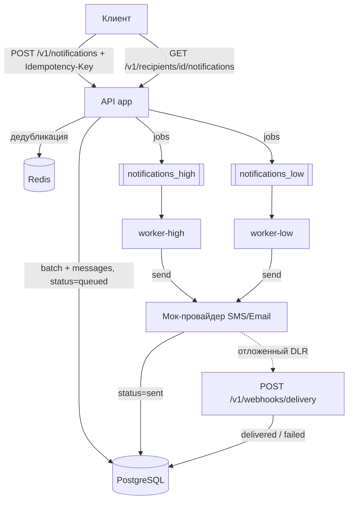

# Notification Service

Микросервис массовой рассылки SMS/Email-уведомлений: приоритезация трафика, гарантии доставки (at-least-once + exactly-once на уровне бизнес-логики), идемпотентность запросов, детализация статусов и webhook для отчётов провайдера.

**Стек:** PHP 8.4 · Laravel 13 · PostgreSQL 17 · RabbitMQ 4 · Redis 7 · Docker

## Быстрый старт

```bash
git clone <repo-url> && cd Messenger
docker compose up -d --build
```

Больше ничего настраивать не нужно — миграции и генерация OpenAPI-спеки выполняются автоматически при старте.

| Что | Где |
|---|---|
| API | http://localhost:8080/api/v1 |
| Swagger UI | http://localhost:8080/api/documentation |
| RabbitMQ Management | http://localhost:15672 (guest/guest) |
| Postman-коллекция | [docs/postman_collection.json](docs/postman_collection.json) |
| Документация для ревью | [docs/ARCHITECTURE.md](docs/ARCHITECTURE.md) |

### Запуск тестов

```bash
docker compose exec app php artisan test
```

Интеграционные тесты (Pest) выполняются против реальных PostgreSQL (отдельная БД `notifications_test`) и Redis и покрывают всю цепочку: приём запроса → постановка в очередь → вызов провайдера → смена статусов в БД → webhook доставки.

## Архитектура



### Приоритезация трафика

Две очереди RabbitMQ и **выделенный воркер** на каждую: `worker-high` слушает только `notifications_high` (транзакционные уведомления), `worker-low` — только `notifications_low` (маркетинг). Транзакционное сообщение физически не может ждать маркетинговую рассылку — даже если в low-очереди миллион сообщений, у high-трафика собственный консьюмер.

### Статусы уведомления

`queued` → `sent` → `delivered` | `failed`

- **queued** — принято и поставлено в очередь;
- **sent** — передано шлюзу, получен `provider_message_id`;
- **delivered** — провайдер подтвердил доставку через webhook;
- **failed** — отброшено: провайдер отклонил получателя, исчерпаны ретраи или пришёл отрицательный отчёт о доставке.

В БД статусы хранятся числами (int-backed enum `NotificationStatus`), наружу API отдаёт строковые метки.

### Гарантии доставки

- **Персистентность** — задания живут в RabbitMQ; джобы публикуются только после коммита транзакции (`after_commit`), поэтому в очередь не попадает сообщение, которого нет в БД.
- **At-least-once** — брокер может доставить job повторно (ack после обработки).
- **Exactly-once на бизнес-уровне** — три слоя защиты:
  1. условный переход статуса (`UPDATE ... WHERE status = queued`) — финализированное уведомление не обрабатывается повторно;
  2. `WithoutOverlapping` middleware (Redis-lock) — два воркера не обрабатывают одно уведомление одновременно;
  3. провайдер дедуплицирует по клиентскому reference (UUID уведомления) — повторная доставка job не порождает второй отправки.
- **Retry** — до 5 попыток с экспоненциальным backoff (5/15/30/60 сек) при временной недоступности шлюза; после исчерпания — `failed` + запись в `failed_jobs`.
- **Rate limiting** — общий бюджет вызовов шлюза для всех воркеров (`RateLimited` middleware на Redis, по умолчанию 50 rps).

### Идемпотентность (дедубликация запросов)

Заголовок `Idempotency-Key` обязателен. Два слоя:
1. **Redis** — быстрый ответ для недавних повторов (TTL 24 ч);
2. **unique constraint в PostgreSQL** — источник истины: выдерживает гонку конкурентных одинаковых запросов и очистку Redis.

Повторный запрос возвращает `200` с тем же batch и `duplicate: true` (первый — `202`).

### Мок-провайдеры

`FakeSmsProvider` / `FakeEmailProvider` реализуют `NotificationProviderInterface` и подменяются реальными шлюзами через DI-биндинг. Поведение управляется «магическими» получателями:

| recipient_id | Сценарий |
|---|---|
| `fail-*` | Провайдер отклоняет (несуществующий номер/email) → `failed` без ретраев |
| `flaky-*` | Шлюз «лежит» первые 2 попытки → успех с 3-й (демо ретраев) |
| `undeliverable-*` | Принято шлюзом, но DLR отрицательный → `sent` → `failed` |
| любой другой | `sent` → `delivered` |

После «отправки» провайдер с задержкой шлёт отчёт о доставке — тем же кодом, которым обрабатывается публичный webhook `POST /v1/webhooks/delivery` (имитация Twilio/SendGrid DLR).

## API

Полное описание — в [Swagger UI](http://localhost:8080/api/documentation) или [Postman-коллекции](docs/postman_collection.json).

| Метод | Путь | Назначение |
|---|---|---|
| `POST` | `/api/v1/notifications` | Запуск массовой рассылки (заголовок `Idempotency-Key` обязателен) |
| `GET` | `/api/v1/recipients/{id}/notifications` | История и статусы уведомлений подписчика (фильтры `status`, `channel`, пагинация) |
| `POST` | `/api/v1/webhooks/delivery` | Приём отчёта о доставке от провайдера |

Пример:

```bash
curl -X POST http://localhost:8080/api/v1/notifications \
  -H 'Idempotency-Key: demo-001' \
  -H 'Content-Type: application/json' \
  -d '{
    "channel": "sms",
    "priority": "transactional",
    "text": "Ваш код доступа: 4821",
    "recipient_ids": ["42", "fail-13", "flaky-99", "undeliverable-7"]
  }'

# через несколько секунд:
curl http://localhost:8080/api/v1/recipients/42/notifications
```

## Качество кода

```bash
composer lint      # Laravel Pint (+ strict_types)
composer analyse   # PHPStan / Larastan, level 6
composer test      # Pest
```

## Структура

```
app/
├── DTO/                  # SendNotificationsData, BatchCreationResult
├── Enums/                # Channel, NotificationPriority, NotificationStatus (int-backed)
├── Exceptions/           # ProviderRejected / ProviderTemporarilyUnavailable
├── Http/                 # контроллеры, FormRequest'ы, API Resources
├── Jobs/                 # SendNotificationJob, SimulateProviderCallbackJob
├── Models/               # NotificationBatch, NotificationMessage
└── Services/
    ├── NotificationBatchService.php   # приём рассылки + идемпотентность
    ├── NotificationHistoryService.php # выборка истории подписчика
    ├── DeliveryReportService.php      # применение DLR (идемпотентное)
    └── Providers/                     # интерфейсы, реестр, мок-провайдеры
```
